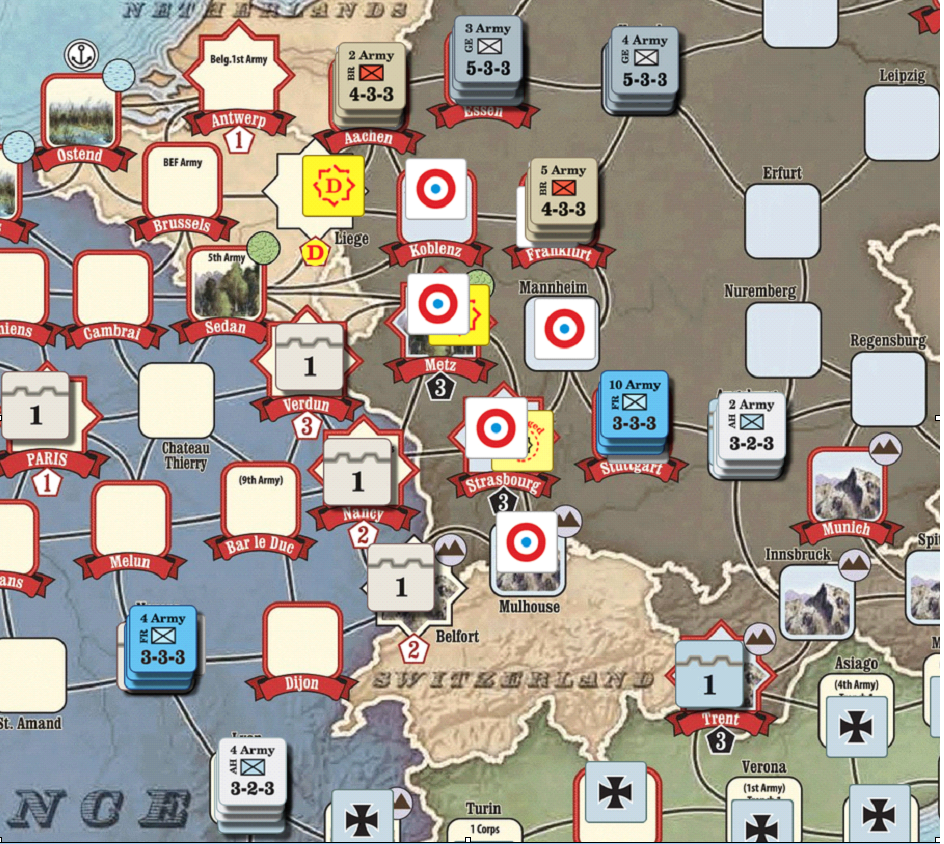

# 番外：西 线 无 战 事——LW Budapest交换的数学期望

> 免责声明：本页面是2018年规划的。鸽子不保证2020年此战术还有效，这里只是作为一个分析实例展示如何在更加复杂的情况下计算一场战役的数学期望。

### 太长不看版

* RU每进攻一次纯AH的布达，大致赚1-1.5op，四舍五入就是半个集团军（德国爸爸救命啊！）
* 和我们的印象相同，在AH火力较高时RU应该尽可能带c进攻buda，不然会平白遭受至多一轮1op的额外伤亡。总是把布达门口的c-补成满c可能是个好主意，反正Kharkov躺着a和躺着a-也差不多。
* 和我们的印象相同，AH应该补c-而不是c。
* 如果布达只有一个GEA，RU每次进攻赚多少呢？敬请期待（指2022年见）

### 前言

在本群的远古时期（指2018），RU在LW大举进攻Budapest是在群里非常流行的战术，因为AP可以借此压制AH对意大利的反攻，保护LW脆弱的意大利。

本开局通常的情况如下：俄国补员点在Kharkov，击穿奥匈的Gorlice后，从北侧和东侧两个方向半包围Budapest。Buda会在若干个LW回合内抗压挨打，直到有GEA南下拯救奥匈（通常来的不是很快，而且来一个不一定完全够用）。GEA到来之后RU会继续试着进攻一段时间，直到进攻无望（通常发生于CP进TW上新GEA）之后撤退。

这个Buda磨坊通常会耗尽双方LW的大部分空闲op，所以鸽子决定把本实例命名为"西线无战事“。

在2018年，CP事件Entrench在Buda放置一级壕是标开。鉴于要考虑可能的德国人死光之后的Brusilov攻势，2018年的Buda通常不会挖两级壕，以下按Buda一级壕处理。

和西线的情况不同，东线是一个更加血腥的战场（历史上也是如此）。这表现为双方都是2防，以及单个堆叠只能凑出可怜的9火，所以1.2里的结论不太适用。我们首先列出火力表：

.png>)

然后是AH，AH最多凑出12火：

.png>)

### RU要带c进攻吗？

和西线只要1op就能到mole线的通常情况不同，RU需要从遥远的Kharkov哈尔科夫爬3op过来。理想情况下RU应该三个三个爬，但是实际上并不能完全这么理想——为了让结果好看一些，我们近似的取从Kharkov爬一个RUA过来的价格为1.33op。

因此，被打翻面一个A的价格为1.33op（4op/3），被打死一个A的价格是4op。c一面价格为0.66op（事实上应该更低，因为这个阶段ruc几乎是无限的）。

因此，即使我们高估c的价格，AH打带c和不带c的RU的伤害（按op算）分别为

.png>)

.png>)

这和我们的印象相同，也就是AH的火力如果较高（这里是>=6），就应该带上c打，和西线的结论相反。在AH满火的时候，甚至打一次就亏1op。

当然，鉴于sr一个c的价格高达0.75op，所以还是用死出来的c-（或者死出来的c-补出来的c，这是坠吼的）参加进攻吧。

### AH该补c还是c-？

AH的复活点就在buda，因此没有走路的费用。但是和RU相比，AHA很贵——打翻面的价格是2op，打死一个价格4op，一面c价格1op——差不多可以认为每打出1损就是1op。布达磨坊的后期AH经常陷入没有c的境地，因此不得不补c-。

显然，如果能补a没人会补c，因此补一个c-相当于AH赚了1op（指省下了补满c的1op），那么为此AH的损失会不会大于1op呢？

* 首先AH为此损失了1火。大多数情况下AH被打到这种程度，损失1火就约等于损失1列。
* 其次，AH在此时已经不能维持布达的火力，这导致有机会吃额外的取消撤退损失。

我们首先考虑俄国人进攻的价格。激活堆叠要2op。吃的伤亡里c其实基本不用补（如上所述，RUc这时候是无限的），所以死掉c的唯一损失是下次进攻不能带c（因此损失了大约0.5op）。平均一下，大概俄国人每进攻一次要花费4.5-5.5op。

然后我们考虑俄国人对AH造成的伤害：

.png>)

因此不考虑取消撤退的话RU对AH造成的伤害和RU花的钱差不多。

重头戏是取消撤退。这件事情经常发生（尤其是AH火力不足之后），在AH不得不补c-的时候AH基本上只有每回合的第一轮能9火，接下来就疯狂下降。

9火打15火需要取消撤退的概率高达22/36=61%，AH火力下降之后这个问题更严重。我们姑且就取差两列的平均结果——65%。每次取消撤退的情况下AH会多死1op或2op不等（取决于你堆叠里还有没有c，但是多半这时候是有的），我们姑且算每次取消撤退AH损失1.3op。于是因为取消撤退AH会额外损失0.85op。

因此，每次布达交换RU大致用5op换了AH 6.5op，盈利30%。

因此，纯AH补c-的代价是

* 少对俄国人造成一列伤害，大概0.4op
* 降低一列火，多15%概率被打成取消撤退，大概0.2op

总的来说是赚了。

如果堆叠里还有德国人，补AHc-就更合理了。

### 德国爸爸救命啊！

如果来了两个德国爸爸，俄国人当然应该直接鸽了。但是大多数情况下德国爸爸没空来两个。如果只有一个德国爸爸，俄国人该不该继续打呢？

（敬请期待下期）

